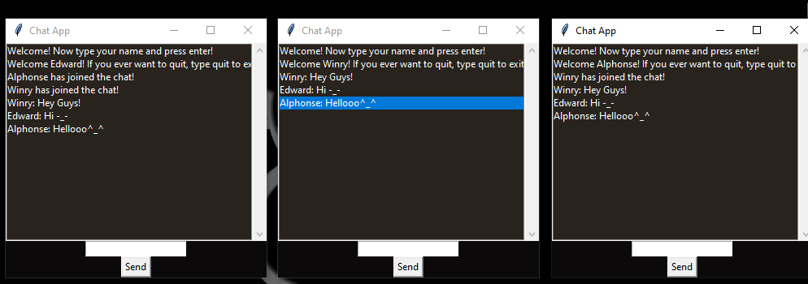

# Chat_App

Chat App to allow communication between multiple users on same or different networks. Used socket programming concepts to establish connection between nodes. 
Used multithreading to support group chat feature.

**Steps to Run:**
- Edit lines 13,14 and 16 in run.py . 
```
    sender_email = "sender@gmail.com"               #sender's mail id
    receiver_email  = ['reciever@gmail.com']        #list of reciever's mail ids
    #password = getpass.getpass(prompt="Type your password and press enter: ")
    password = 'enter-sender-password-here'
```
Here, the host ip address will be mailed to the sender mail address when the server has started.
- Start the server by running the run.py file on the host machine .
- In the client machines, edit line 52 in client.py . Here, copy paste the host ip address that was mailed to the specified mail address.
```
host = 'enter-host-ip-address-here'
```
- Run the client.py files on the client machines.               
Thats it ^_^

# Demo

